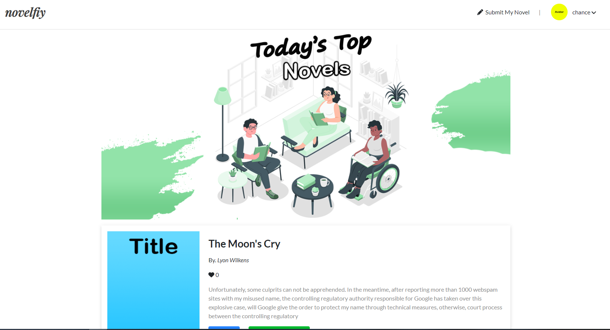

# Novelfiy

## Description
A full stack MERN application meant for the avid bookworm! This is a passion project of mine. It is a novel-sharing website meant for spreading awareness to original novels from aspiring authors, as well as having discussions about those original novels.

## How To Run Application
1. Git clone the repository
2. Open up code in a text editor.
3. Enter "npm run install" into the terminal from the root of the project
4. After the installation, enter "npm run develop" into the terminal.

## Usage
Create an account to begin exploring. Share your story by creating your novel and adding chapters for others to enjoy! Leave reviews on novels, give constructive feedback to others by commenting on the chapters of their book, follow other user accounts, and save novels to your "favorite novels" list. Have fun and tell your story.

## Made With
* NoSQL
* MongoDB
* React
* GraphQL
* Bootstrap

## Website
http://novelfiy-dev.herokuapp.com/